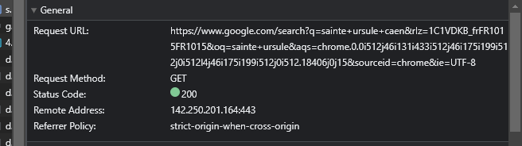
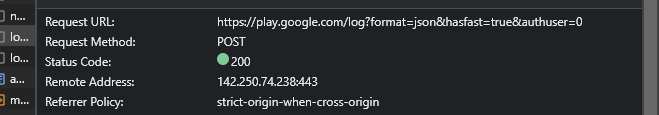

# bloc1

**GET OU POST ?**

**GET**
Get est utilisé pour intérroger le serveur, la méthode consiste a demander des informations aux serveurs,j'ai effectué un test
en effectuant une recherche sur internet, donc en théorie j'interroge le serveur : 
\
\

**POST**
A contrario la méthode POST est utilisé pour envoyé des informations sur le serveurs, comme par exemple envoie d'un formulaire.
j'ai remplie un formulaire de connexion sur un site internet au moment d'appuyer sur envoyer on peut voir une requete POST 
qui envoie les informations sur le serveur :
\
\

|                    | POST                                     | GET                                       |
|--------------------|------------------------------------------|-------------------------------------------|
| Fonctionnement     | Envoyer informations au serveur          | Recevoir informations depuis le serveur   |
