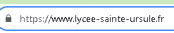

# bloc1

**GET OU POST ?**

**GET**
Get est utilisé pour intérroger le serveur, la méthode consiste a demander des informations aux serveurs,j'ai effectué un test
en effectuant une recherche sur internet, donc en théorie j'interroge le serveur : 

**POST**
A contrario la méthode POST est utilisé pour envoyé des informations sur le serveurs, comme par exemple envoie d'un formulaire.
j'ai remplie un formulaire de connexion sur un site internet au moment d'appuyer sur envoyer on peut voir une requete POST qui envoie les informations sur le serveur :

|                    | POST                                     | GET                                       |
|--------------------|------------------------------------------|-------------------------------------------|
| Fonctionnement     | Envoyer informations au serveur          | Recevoir informations depuis le serveur   |
| Sécurité           | sécurisé car les données sont cryptés(cahé dans la requête)| moins sécurisé car on voit les données dans l'url  |
| Status code     | CODE200         | CODE200   |

**Le protocole HTTP est extensible !**

les nouvelles mises a jour de http ont introduit la notion d'extensions de protocole, qui permettent aux clients et aux serveurs de négocier et d'activer des fonctionnalités supplémentaires. Ces extensions peuvent inclure la compression, la gestion de la sécurité, la gestion des cookies, le protocole HTTP permet également de définir de nouvelles méthodes HTTP personnalisées qui permettent de demander des informations visées sans pour autant changer le protocole en lui-meme.

**Que signifie le fait qu’http soit qualifié de protocole sans état ?**

Le fait que le protocole http soit qualifié de protocole sans état veut dire que lorsqu'il y a une requete sur le serveur, la requête et la réponse sont indépendants, les conséquences sur la navigation sont : 
1. Le serveur ne garde aucunes traces des actions car il est autonome, il n'a pas de mémoire
2. Le serveur ne sauvegarde rien ce qui lui permet de repondre aux plusieurs demande des utilisateurs dans le monde
3. Or pour garder la connexion les sites web utilisent les cookies.

**Décomposer une URL en ces différentes parties**

